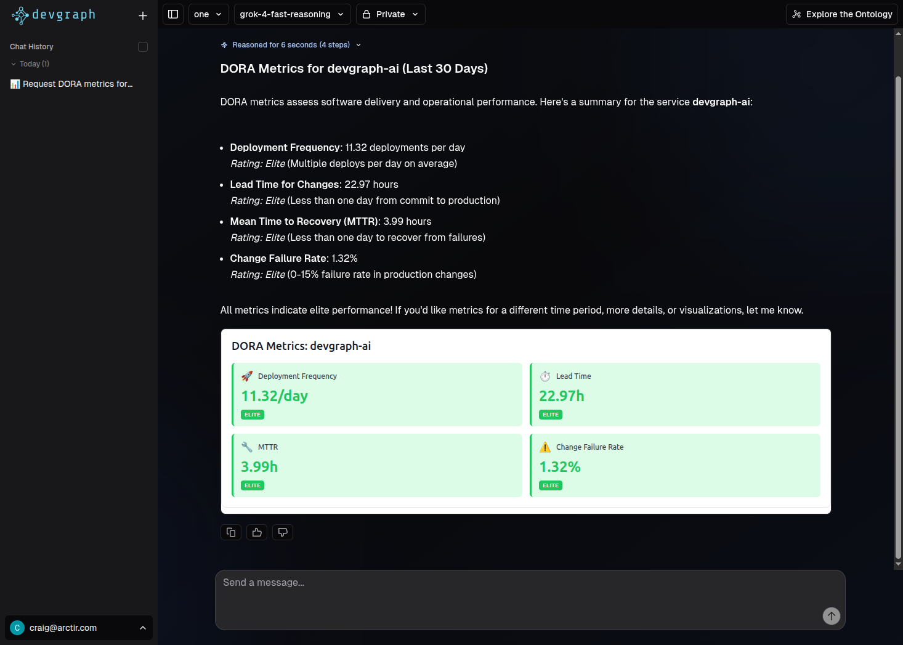

# DORA Metrics Molecule Demo

A demo repository showcasing how to build a [devgraph-ai](https://github.com/arctir/devgraph-ai) MCP molecule that provides both:
1. **MCP tools** for data retrieval
2. **JS components** for custom UI visualization (RemotePlugin pattern)

This is a contrived example demonstrating how users can leverage devgraph-ai renderers to display their own custom UI widgets alongside AI tool results.



## What This Demonstrates

### Static Asset Serving from MCP Server

Molecules can declare static assets (JS/CSS) that should be served by the devgraph MCP server:

```python
class DoraMCPMolecule:
    # Static assets this molecule provides
    static_assets = {
        "dora-metrics.js": Path(__file__).parent.parent / "static" / "dora-metrics.js",
    }
```

The devgraph MCP server collects these from all loaded molecules and serves them at `/static/{filename}`.

### Tool Results with Renderer Metadata

Tools return data with `_meta.renderer` to specify how the UI should render results:

```python
def get_dora_metrics(self, service: str) -> dict:
    return {
        **metrics_data,
        "_meta": {
            "renderer": {
                "type": "remote",
                "source": f"{self.config.base_url}/static/dora-metrics.js",
            }
        },
    }
```

The dashboard's `ToolResultRenderer` uses this to load and render the JS component.

## Structure

```
devgraph-dora-molecule-demo/
├── dora_molecule/
│   ├── __init__.py
│   ├── mcp.py           # Main molecule with DORA tools
│   └── server.py        # Example standalone server
├── static/
│   └── dora-metrics.js  # JS component for rendering
├── pyproject.toml       # Package definition with entry point
└── README.md
```

## DORA Metrics

This demo provides tools for the four key DORA metrics:

- **Deployment Frequency** - How often code is deployed to production
- **Lead Time for Changes** - Time from commit to production
- **Mean Time to Recovery (MTTR)** - Time to restore service after incident
- **Change Failure Rate** - Percentage of deployments causing failures

## Installation

```bash
# Clone the repository
git clone https://github.com/arctir/devgraph-dora-molecule-demo.git
cd devgraph-dora-molecule-demo

# Install with uv
uv sync

# Copy example config
cp config.yaml.example config.yaml
```

## Configuration

Edit `config.yaml` to set your MCP server URL:

```yaml
mcp:
  name: "DevgraphMCPServer"
  host: "127.0.0.1"
  port: 9000
  base_url: "https://mcp.example.com"  # URL where JS assets will be served
  molecules:
    - name: "dora"
      type: "dorademo.molecules.devgraph.ai"
```

## Integration with devgraph MCP Server

This molecule is loaded via the entry point system:

```toml
[project.entry-points."devgraph.molecules"]
"dorademo.molecules.devgraph.ai" = "dora_molecule.mcp:DoraMCPMolecule"
```

The devgraph MCP server will:
1. Load the molecule via entry point
2. Collect `static_assets` and serve them at `/static/{fqdn}/{version}/{filename}`
3. Make tools available via MCP protocol

## License

Apache 2.0 - see [LICENSE](LICENSE) for details.
